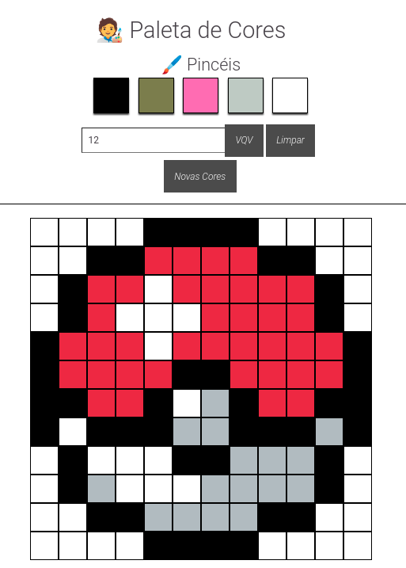

# Boas vindas ao repositório do projeto Arte com Pixels!

  
  

    <h2>Módulo: Fundamentos do Desenvolvimento Web</h2>
    
      Este Repositório possuí projeto desenvolvido no período que estive na Trybe, abordando sobre conceitos de estilização, manipulação do DOM com Javascript e reutilização de código.
    
  

   

## Preview

  <a href="https://marlondlacerda-pixel-art.vercel.app/">Clique aqui</a> para ter acesso a um preview do App.

---

  

## HABILIDADES
- Manipular o DOM
- Manipular Javascript

## O que foi desenvolvido
- Implementar uma página web que contém uma paleta de cores funcional que poderá ser utilizada para criar desenhos em pixels. Para isto você irá utilizar <code>HTML</code>, <code>CSS</code> e <code>JavaScript</code>.
---

# Instruções para instalar e rodar os testes de cada requisito
1. Clone o repositório
  * `git clone git@github.com:marlondlacerda/trybe-projetos.git`
  * Entre na pasta do repositório que você acabou de clonar:
    * `cd trybe-projetos/fundamentals/bloco_5/pixel-art`

2. Instale as dependências e inicialize o projeto
  * Instale as dependências:
    * npm install

3. Entre no Vs Code para verificar os arquivos
  * Atalho no terminal: `code . `
  * A pasta test contém os testes que verifica se as funções estão atendendo o que foi pedido

4. Leia os Requisitos do Projeto logo abaixo explicando o que cada requisito propõem

5. Use o cypress para rodar os tests
  * Atalho no terminal: `npm run cypress:open`

***

    
Requisitos do projeto

- [x] 1 - Adicione à página o título "Paleta de Cores".
  - O título deverá ficar dentro de uma tag `h1` com o `id` denominado `title`.

- [x] 2 - Adicione à página uma paleta de quatro cores distintas.
  - A paleta de cores deve ser um elemento com <code>id</code> denominado <code>color-palette</code>, ao passo que cada cor individual da paleta de cores deve possuir a <code>classe</code> <code>color</code>;
  - A cor de fundo de cada elemento da paleta deverá ser a cor que o elemento representa. A única cor não permitida na paleta é a cor branca.;
  - Cada elemento da paleta de cores deverá ter uma borda preta, sólida e com 1 pixel de largura;
  - A paleta de cores deverá listar todas as cores disponíveis para utilização lado a lado, e deverá ser posicionada abaixo do título "Paleta de Cores";
  - A paleta de cores não deve conter cores repetidas.

- [x] 3 - Adicione na página a cor preta ela deve ser a primeira na paleta de cores.
  - Verifica se a primeira cor da paleta é preta
  - Verifica se as demais cores podem ser escolhidas livremente.

- [x] 4 - Adicione à página um quadro de pixels, com 25 pixels.
  - Verifica se o quadro de pixels possui o <code>id</code> denominado <code>pixel-board</code>
  - Verifica se cada pixel individual dentro do quadro possui a classe denominada pixel.
  - Verifica se a cor inicial dos pixels dentro do quadro, ao abrir a página, é branca.
  - Verifica se o quadro de pixels aparece abaixo da paleta de cores

- [x] 5 - Faça com que cada elemento do quadro de pixels possua 40 pixels de largura, 40 pixels de altura e seja delimitado por uma borda preta de 1 pixel.
  - Verifica se o quadro de pixels tem altura e comprimento de 5 elementos
  - Verifica se 40 pixels é o tamanho total do elemento, incluindo seu conteúdo e excluindo a borda preta, que deve ser criada à parte.

- [x] 6 - Definia a cor preta como cor inicial. Ao carregar a página a cor preta já deve estar selecionada para pintar os pixels.
  - O elemento da cor preta deve possuir, inicialmente, a <code>classe</code> <code>selected</code>;
  - Note que o elemento que deverá receber a classe <code>selected</code> deve ser um dos elementos que possuem a classe <code>color</code>, como especificado no requisito 2.

- [x] 7 - Selecione uma das cores da paleta, ao clicar, a cor selecionada é a que será utilizada para preencher os pixels no quadro.
  - A <code>classe</code> <code>selected</code> deve ser adicionada à cor selecionada na paleta, ao mesmo tempo em que é removida da cor anteriormente selecionada;
  - Somente uma das cores da paleta deve ter a <code>classe</code> <code>selected</code> de cada vez;
  - Note que os elementos que deverão receber a classe <code>selected</code> devem ser os mesmos elementos que possuem a classe <code>color</code>, como especificado no requisito 2.

- [x] 8 - Clicar em um pixel dentro do quadro após selecionar uma cor na paleta, faz com que o pixel seja preenchido com a cor selecionada.
  - Verifica se ao carregar a página deve ser possível pintar os pixels de preto
  - Verifica se após selecionar uma outra cor na paleta, é possível pintar os pixels com essa cor
  - Verifica se somente o pixel que foi clicado foi preenchido com a cor selecionada, sem influenciar na cor dos demais pixels.

- [x] 9 - Crie um botão que, ao ser clicado, limpa o quadro preenchendo a cor de todos seus pixels com branco.
  - Verifica se o botão tem o <code>id</code> denominado <code>clear-board</code>
  - Verifica se o botão está posicionado entre a paleta de cores e o quadro de pixels
  - Verifica se o texto do botão é 'Limpar'
  - Verifica se ao clicar no botão, o quadro de pixels é totalmente preenchido de branco

### BÔNUS
- [x] 10 - Faça o quadro de pixels ter seu tamanho definido pelo usuário.
  - Crie um input e um botão que permitam definir um quadro de pixels com tamanho entre 5 e 50. Ao clicar no botão, deve ser gerado um quadro de N pixels de largura e N pixels de altura, onde N é o número inserido no input;
  - Ou seja, se o valor passado para o input for 7, ao clicar no botão, vai ser gerado um quadro de 49 pixels (7 pixels de largura x 7 pixels de altura);
  - O input deve ter o <code>id</code> denominado <code>board-size</code> e o botão deve ter o <code>id</code> denominado generate-board;
  - O input só deve aceitar número maiores que zero. Essa restrição deve ser feita usando os atributos do elemento input;
  - O botão deve conter o texto "VQV";
  - O input deve estar posicionado entre a paleta de cores e o quadro de pixels;
  - O botão deve estar posicionado ao lado do input;
  - Se nenhum valor for colocado no input ao clicar no botão, mostre um <code>alert</code> com o texto: "Board inválido!";
  - O novo quadro deve ter todos os pixels preenchidos com a cor branca.

- [x] 11 - Limite o tamanho do mínimo e máximo do board.

  ✦  Caso o valor digitado no input <code>board-size</code> fuja do intervalo de 5 a 50, faça:

    - Valor menor que 5, considerar 5 como padrão;
    - Valor maior que 50, considerar 50 como padrão.

- [x] 12 - Faça com que as cores da paleta sejam geradas aleatoriamente ao carregar a página.
  - A cor preta ainda precisa estar presente e deve ser a primeira na sua paleta de cores.

### RECURSOS EXTRAS DESENVOLVIDOS POR MIM
- [x] 13 - Adicione na paleta a cor branca, ela deve ser a última na paleta de cores.
  - A cor de fundo deve ser branco e estar posicionado no final da paleta de cores;
  - O elemento deve possuir a <code>classe</code> denominada <code>eraser</code>
  - A <code>classe</code> <code>selected</code>deve ser adicionada à cor selecionada na paleta, ao mesmo tempo em que é removida da cor anteriormente selecionada;

  **Esse recurso foi adicionado para que o usuário consiga corrigir pixels indesejados no quadro de pixels!**

- [x] 14 - Crie um novo botão para gerar novas cores.
  - O botão deve estar abaixo dos inputs anteriormente criados
  - O botão deve conter o texto "Novas Cores"
  - O <code>id</code> <code>new-colors</code>deve ser adicionado ao botão
  - Ao clicar no botão, as cores da paleta serão geradas aleatoriamente mantendo a cor preta e branca presentes

- [x] 15 - Adicione title nos inputs.
  - Ao passar o mouse por cima dos inputs e botões, deve possuir um texto explicando a funcionalidade de cada um

---

  <a href="https://github.com/marlondlacerda/trybe-projetos">Voltar para o repositório principal</a>

  [⬆ Voltar para o topo](#boas-vindas-ao-repositório-do-projeto-arte-com-pixels)

